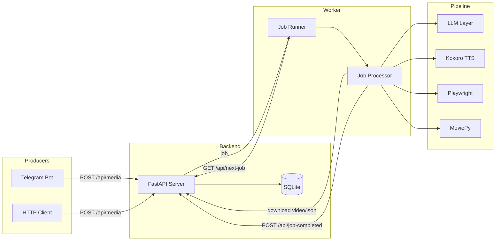
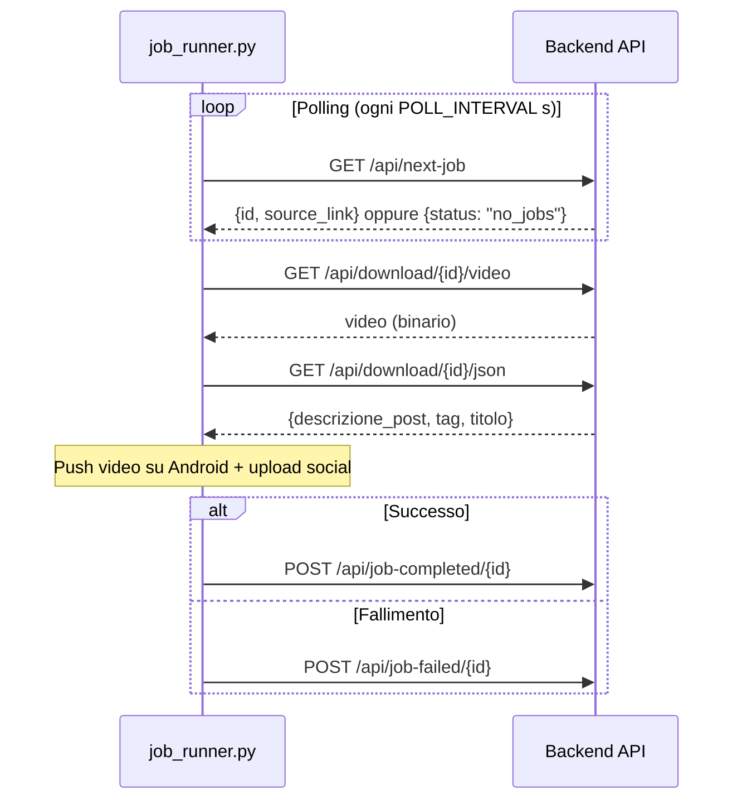
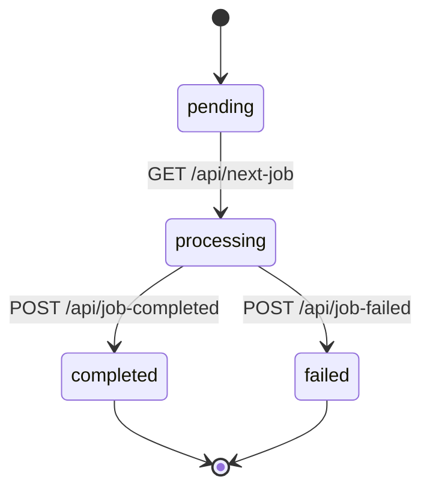

# Architecture

This document describes the high-level architecture of the GitHub Reel
Generator, its modules and the polling API contract.

---

## Overview

The system is a **producer/consumer job pipeline**:

- **Producers** (e.g. the Telegram bot) create jobs via the backend API.
- The **backend** (FastAPI + SQLite) maintains a queue of pending jobs.
- **Workers** (the job runner) poll the backend, download job assets, run the
  media pipeline and report completion.

This decoupling lets you run the heavy media pipeline on a separate machine
from the queue, and scale workers independently.

---

## System diagram



---

## Module breakdown

| Module | Responsibility |
|--------|----------------|
| `config.py` | Loads all settings from `.env` into an immutable `Settings` dataclass. Single source of truth for configuration. |
| `logging_config.py` | Configures structured logging (console + rotating file). Provides `get_logger()`. |
| `llm.py` | Builds provider clients and implements `safe_chat_completion`, which tries Nvidia NIM models then OpenRouter models. |
| `content.py` | Text generation: script, post description, title, tags, and LLM-based JSON validation. Also fetches README and web context. |
| `tts.py` | Local text-to-speech via Kokoro (CPU). |
| `video.py` | Playwright scroll recording, Groq Whisper transcription, and MoviePy final assembly with subtitles. |
| `pipeline_core.py` | Orchestrates the full pipeline for a single repository. |
| `telegram_bot.py` | Telegram handlers that trigger the pipeline and deliver results. |
| `job_runner.py` | Polling worker entry point. |
| `job_processor.py` | Client for downloading job assets and notifying the backend. |
| `adb_automation.py` | Android ADB helpers (wake/unlock, tap, type, TikTok upload). |
| `server.py` | FastAPI backend implementing the polling API. |
| `db.py` | SQLite persistence layer for jobs. |

---

## Data flow



---

## API contract

The client (`job_runner.py` + `job_processor.py`) communicates with the backend
via `config.API_URL` (set in `.env`).

### `GET /api/next-job`

Returns the next pending job, or `{"status": "no_jobs"}` when the queue is empty.

```json
{ "id": 96, "source_link": "https://example.com/video.mp4" }
```

### `GET /api/download/{job_id}/video`

Streams the video file for a job (client timeout: 30s).

### `GET /api/download/{job_id}/json`

Returns the post metadata JSON (client timeout: 10s).

```json
{
  "descrizione_post": "Testo della descrizione del post",
  "tag": "tech, python, automazione",
  "titolo": "Titolo del video (usato per YouTube)"
}
```

### `POST /api/job-completed/{job_id}`

Marks a job as completed.

### `POST /api/job-failed/{job_id}`

Marks a job as failed.

---

## Job lifecycle



The backend tracks each job's status so a job is never assigned twice.

---

## Security notes

- **No secrets are hardcoded.** All API keys and tokens live in `.env`
  (gitignored).
- **No private infrastructure endpoints** are committed. The backend URL is
  configured via `API_URL`.
- The `.gitignore` excludes env files, keys, databases, logs and generated
  media.
